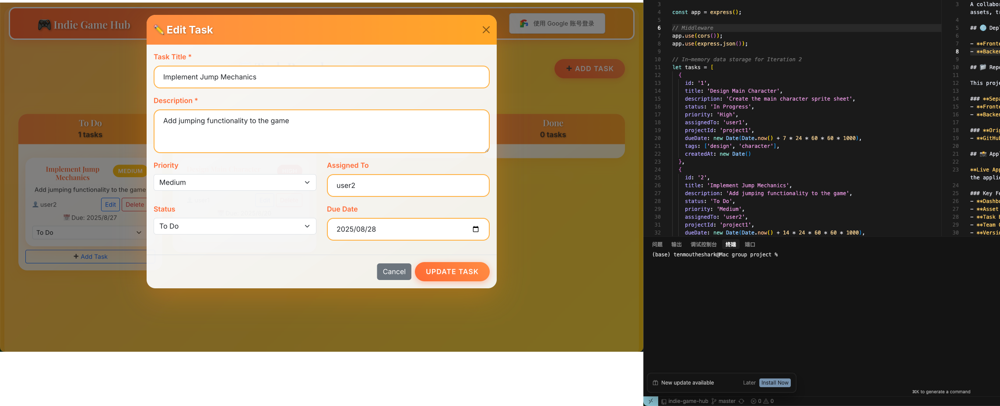

# 🎮 Indie Game Hub - Frontend

A React-based frontend application for indie game development team collaboration.

## 🌐 Live Demo

**Deployed Application**: https://indie-game-hub-2024.uc.r.appspot.com

## 📱 Application Screenshots

### Task Management Features

*Complete task management with CRUD operations, status tracking, and priority management*

### Adding New Tasks

*Modal form for creating new tasks with validation and form controls*

### Application Interface

*Main application interface showing the gaming-themed design and navigation*

## 🚀 Technology Stack

- **React** (v19.1.1) - User interface framework
- **React Bootstrap** (v2.10.10) - UI component library
- **React Router DOM** (v7.7.1) - Client-side routing
- **Axios** (v1.11.0) - HTTP client for API calls
- **Google Fonts** - Playfair Display & Inter fonts

## 📱 Features

### 🎨 Modern UI/UX Design
- **Elegant Typography**: Playfair Display for headings, Inter for body text
- **Orange Gaming Theme**: Warm gradient backgrounds with floating animations
- **Responsive Design**: Mobile-first approach with Bootstrap components
- **Interactive Elements**: Hover effects, animations, and transitions

### 🔐 Authentication System
- **Google-style Login**: Authentic Google OAuth design
- **User Profile Management**: Avatar, dropdown menu, logout functionality
- **Persistent Sessions**: LocalStorage-based session management

### 📋 Core Functionality
- **Dashboard**: Project statistics and overview
- **Asset Management**: Complete CRUD for game assets
- **Task Board**: Kanban-style task management
- **Team Management**: Member coordination and status tracking
- **Version Control**: Release milestone management

## 🛠️ Development

### Prerequisites
- Node.js (v16 or higher)
- npm or yarn

### Installation
```bash
# Install dependencies
npm install

# Start development server
npm run dev
```

### Available Scripts
- `npm run dev` - Start development server (localhost:3000)
- `npm run build` - Build production bundle
- `npm start` - Start production server (for deployment)
- `npm test` - Run test suite

## 🌐 Deployment

### Google Cloud App Engine
The application is deployed using Google Cloud App Engine with Node.js runtime.

```bash
# Build for production
npm run build

# Deploy to Google Cloud
gcloud app deploy
```

### Environment Variables
- `REACT_APP_API_URL` - Backend API URL (defaults to production backend)

## 🎯 Key Components

### Pages
- **Home** (`/`) - Dashboard with statistics and welcome message
- **Assets** (`/assets`) - Game asset management with CRUD operations
- **Tasks** (`/tasks`) - Task board with Kanban-style layout
- **Team** (`/team`) - Team member management
- **Versions** (`/versions`) - Version history and releases

### Components
- **Navigation** - Main navigation bar with authentication
- **GoogleLogin** - Google-style login button
- **UserProfile** - User avatar and dropdown menu

### Contexts
- **AuthContext** - User authentication state management

## 🔗 API Integration

The frontend connects to the backend API for all data operations:
- **Backend URL**: https://indie-game-hub-backend-346389979835.us-central1.run.app
- **API Documentation**: See backend repository for API details

## 📦 Bootstrap Components Used

- Navbar, Nav, Container, Row, Col
- Card, Button, Modal, Form
- Badge, Alert, Spinner, Table
- Dropdown (for user profile)

## 🎨 Design Features

### Typography
- **Headings**: Playfair Display (elegant serif)
- **Body Text**: Inter (modern sans-serif)
- **Font Weights**: Carefully chosen for hierarchy

### Color Scheme
- **Primary**: Orange gradients (#ff6b35 to #ffa726)
- **Background**: Animated gradient with floating elements
- **Cards**: Semi-transparent with glassmorphism effects

### Animations
- **Bouncing elements** for call-to-action items
- **Hover transformations** for interactive elements
- **Background gradient animation** for dynamic feel

## 🔧 Configuration Files

- `app.yaml` - Google Cloud App Engine configuration
- `server.js` - Express server for production serving
- `.gcloudignore` - Files to ignore during deployment

## 📄 License

This project is part of a university course assignment.

---

**Part of the Indie Game Hub project** - A collaborative platform for indie game development teams.